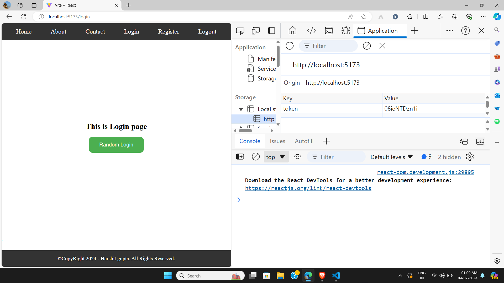

# toggle-navbar-with-send-token-localstorage-reactjs
navbar toggle login and logout and send token in localstorage 
create a random token for auther and toogle navbar (Login - Login logout) 
# genrate random token after click login  
  
<h2>First image without login(genrate Token) and our logout page are not visible </h2>  
  
<h2>In Second image when we loggedin(generate random token) then our login page are gone and page are not found(404 error page)</h2>  
  
<h2>In third image our token and logged page both are exist</h2>  
  
<h2>Before loggin and logout give a alert message</h2>  
  
<h2>Last image token are totally removed login page are visible and logout page are not found(404 error page)</h2>  
  